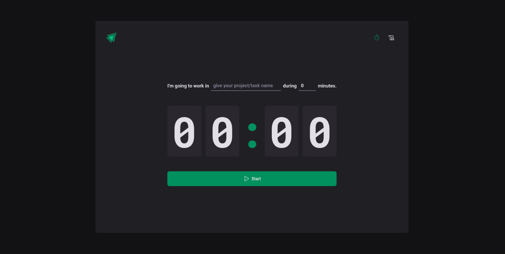
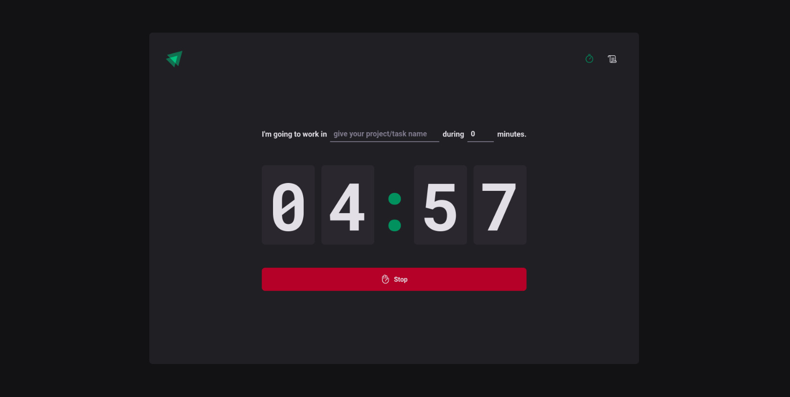
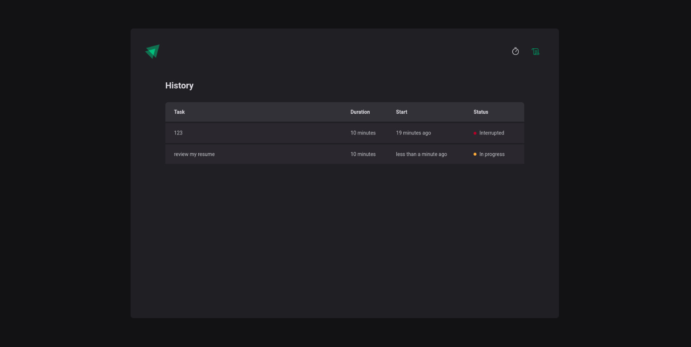

<h1 align="center">
  
  Time manager
</h1>

<br />

<h3 align="center">
  🎯 About Challenge 
</h3>

In this challenge, I want to develop an application to manage my time when I'm doing my daily tasks

- [x] Set the task name and what time I pretend to expend doing this!
- [x] Show digital clock
- [x] Display the history of my tasks with some info's


I need to apply concepts like:

- State
- Use reducers and actions
- LocalStorage
- Routing system
- Properties
- Componentization

<h3 align="center">
  💻 Technologies & Layout
</h3>

- [React](https://reactjs.org)
- [React-hook-form](https://react-hook-form.com/get-started)
- [React-router-dom](https://reactrouter.com/en/main)
- [TypeScript](https://www.typescriptlang.org/)
- [Styled Components](https://styled-components.com/)
- [zod](https://zod.dev/)
- [Phosphor-react](https://phosphoricons.com/)
- [Date fns](https://date-fns.org/)
- [vite](https://vitejs.dev/)

And that was the result achieved

<p align="center">
  
  
  
</p>

<br />


## :gear: | If you want testing

```bash
  ### Copy/clone the project

  ### install the dependencies
  $ npm i
  
  ### running aplication
  $ npm run dev
  
  ### you can see on port http://localhost:5173
```

Developed with ❤️ by [Vinicius de Souto](https://github.com/soutovnc)
